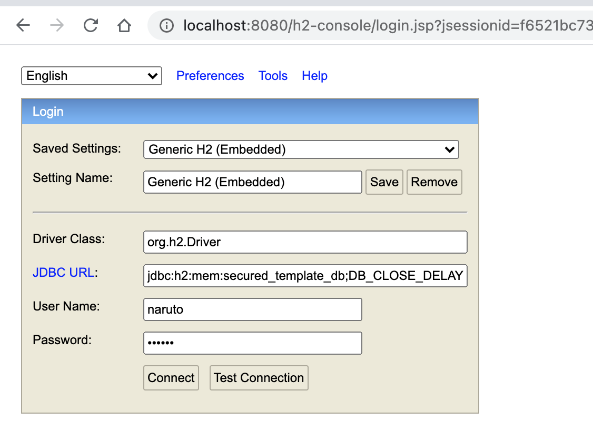
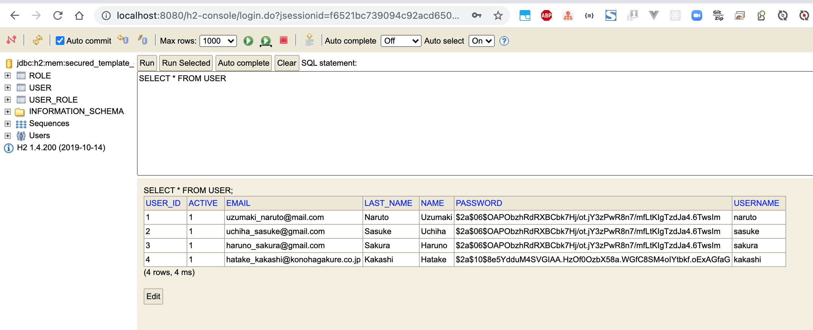
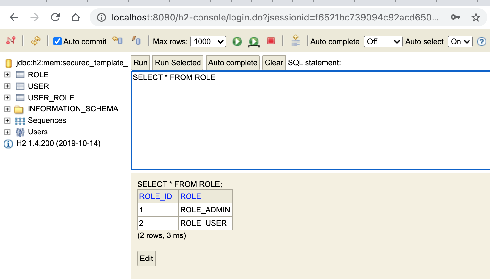
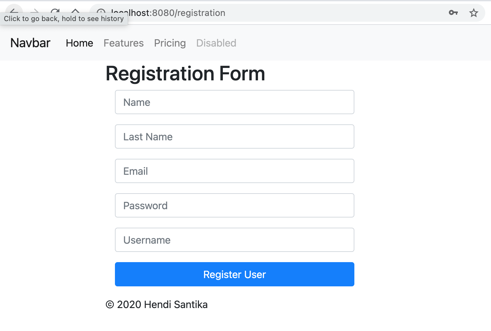
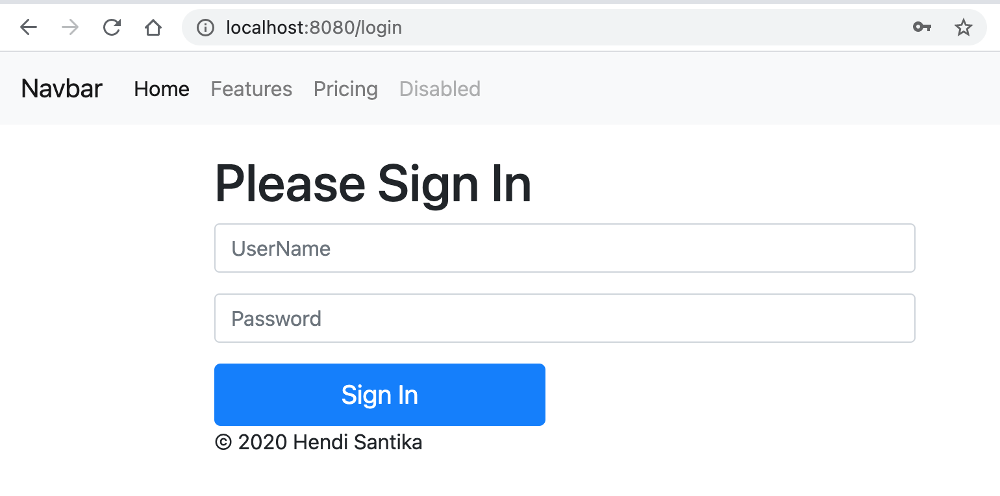

# SpringBoot-Thymeleaf-Template

### Things todo list:

1. Clone this repository: `git clone https://github.com/hendisantika/SpringBoot-Thymeleaf-Template.git`
2. Navigate to the folder: `cd SpringBoot-Thymeleaf-Template`
3. Run the application: `mvn clean spring-boot:run`
4. Open H2 Console on your favorite browser: http://localhost:8080/h2-console
5. Open your favorite browser: http:localhost:8080/registration

### Images Screen shot

H2 Console

Users Data

Role Data

Registration Page

Login Page

